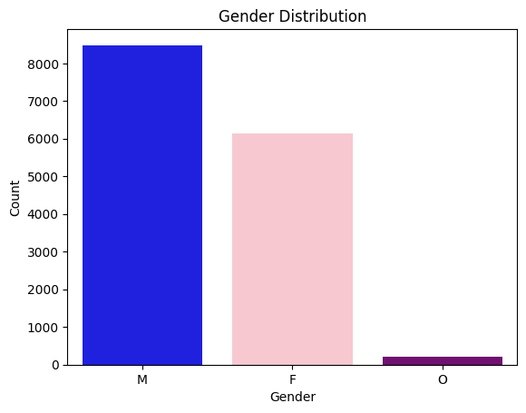
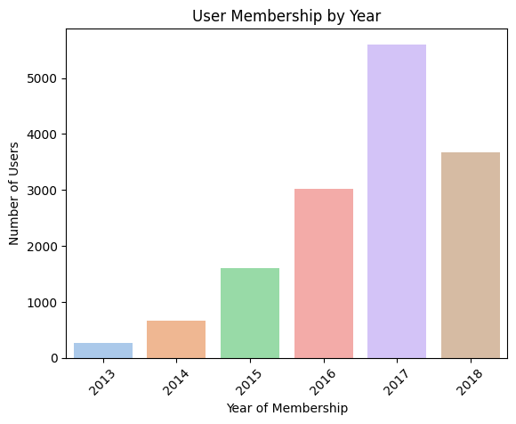
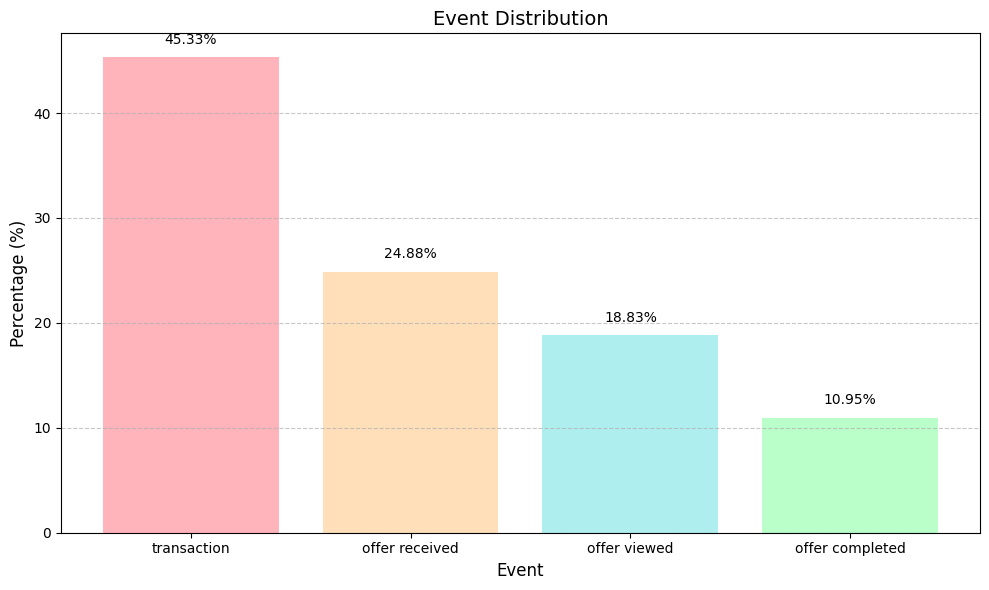
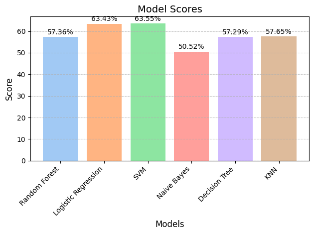
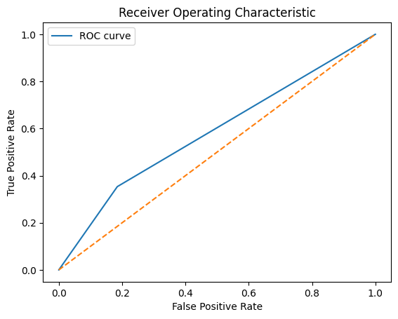

<h1>Starbucks Capstone Project - Exploring coffee lovers responses to Offers: A Data Science Approach</h1>

If you've ever been into a Starbucks you would have experienced the coffee lovers phenomenon. In my country, hundreds of teenagers wait in line to get a cold or hot drink on weekends. A bunch of young adults work on their laptops while slowly drinking coffee. Busy baristas prepare delicious blends and colorfull merchandising waits to be sold out in shelves.
This curious behaviour that people only shows in Starbucks it was made me decide to choose this project.

 

**Project Overview**  
This project investigates how different types of offers influence customer behavior at Starbucks. By analyzing three datasets—*profile*, *transcript*, and *portfolio*—the goal is to build a classification model to predict whether a customer will complete an offer after receiving it. The datasets contain demographic data, transaction information, and offer details, which we explore to uncover patterns and understand customer preferences.

**Problem Statement**  
The central question is: how do different types of offers affect customer behavior? To answer this, we combine customer demographics with transactional data, building a model that predicts whether a customer will complete an offer. This is a binary classification problem, where the outcome is whether or not a customer will act on an offer.

**Metrics Used**  
We primarily used accuracy as our key performance metric to evaluate the predictive power of the models. Accuracy measures the percentage of correct predictions made by the model. Additionally, we used precision, recall, F1-score, and AUC-ROC as secondary metrics to evaluate model performance more thoroughly.

---

### **Analysis**

**Exploratory Data Analysis (EDA)**  
To begin, we explored the *profile* dataset to understand the demographic distribution of Starbucks customers. A few key findings emerged:  
- There were 2,175 missing values in the gender and income columns, requiring data cleaning.  
- The customer base was largely male (49.91%) with females (36.05%) and others (1.25%) making up smaller portions.
- 

 

- The average age of customers varied by gender, with females being slightly older on average (57.54 years) compared to males (52.12 years).  
- Membership growth peaked in 2017, showing rapid adoption of the Starbucks membership program from 2015 onward.

 
  
The *transcript* dataset provided insight into customer interactions with offers. We found that transaction events (45.33%) were the most frequent, followed by "offer received" (24.88%), "offer viewed" (18.83%), and "offer completed" (10.95%). These events helped us understand the customer journey and how offers were processed.  

 
  
In the *portfolio* dataset, we found details about the offers themselves, including type, duration, and other characteristics. This helped us identify key features that could influence customer behavior.

---

### **Methodology**

**Data Cleaning and Preprocessing**  
Data cleaning was a critical step. We handled missing values in the *profile* dataset by replacing outliers, such as the unrealistic age of 118 years, with NaN. We also created age and income clusters to categorize customers more effectively:
- **Age Clusters**: Young Adults (18-25), Adults (26-65), Seniors (65+).
- **Income Clusters**: Moderate, Good, Excellent.

We also created dummy variables for categorical features like offer type and performed feature scaling to prepare the data for modeling.

**Modeling Strategy**  
The core task was to predict whether a customer would complete an offer. This was framed as a binary classification problem. Several algorithms were tested to find the best model for this task:
- **Random Forest**: A collection of decision trees that collectively vote on the prediction.
- **Logistic Regression**: A model that predicts probabilities for classification based on a linear relationship between features.
- **SVM (Support Vector Machine)**: A model that finds the optimal hyperplane separating two classes.
- **Naive Bayes**: A probabilistic model that assumes feature independence.
- **Decision Tree**: A tree-like structure where decisions are made based on feature values.
- **KNN (K-Nearest Neighbors)**: A model that classifies data based on the majority vote of its nearest neighbors.

**Problem Identification and Solution**  
One challenge was the imbalance in the dataset—more customers were not completing offers than those who did. This caused the models to lean towards predicting non-completion. Addressing this imbalance by adjusting the model parameters and using techniques like oversampling could potentially improve performance.

---

### **Results**

**Model Evaluation**  
After evaluating multiple models, we found that the Support Vector Machine (SVM) achieved the highest accuracy (63.55%), closely followed by Logistic Regression (63.43%). These models were effective at predicting whether a customer would complete an offer. In contrast, models like Naive Bayes and Random Forest performed worse, with accuracy scores below 57%.

 

**Confusion Matrix and Performance Analysis**  
The confusion matrix revealed a model bias toward predicting non-completion (Class 0), with strong performance on Class 0 (82% recall) but weak results on Class 1 (35% recall). The AUC-ROC score of 58.4% indicated that the model had a slightly better-than-random chance of distinguishing between the two classes.

 

Despite the promising performance of SVM, further improvements are needed. A higher recall for Class 1 (offer completion) is essential, as the model's ability to predict positive outcomes is still limited.

---

### **Conclusion**

This project explored how Starbucks offers influence customer behavior, using demographic, transaction, and offer data to build a predictive model. While the models showed some promise, the accuracy of around 63% suggests that the current approach is not yet reliable enough for business decision-making. To improve the model, future efforts could focus on addressing data imbalance, incorporating more advanced machine learning techniques, or leveraging additional features such as customer preferences and offer characteristics. Moreover, experimenting with deep learning techniques may yield better results as we refine our model. 

As a next step, additional data or further feature engineering could enhance the model’s ability to predict customer responses more accurately, contributing to more effective targeting of offers and promotions.
